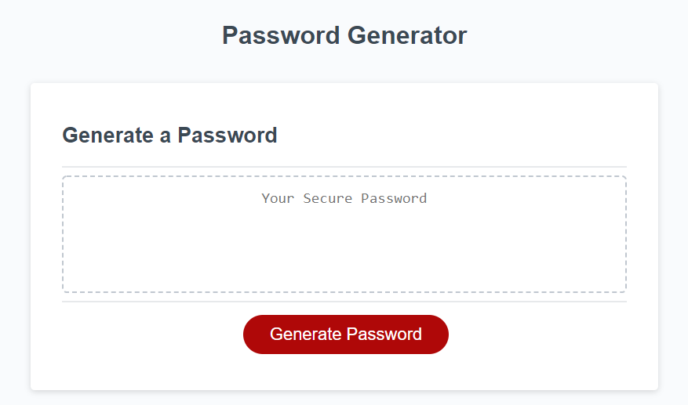

# Password Generator

A simple and easy to use password generator that runs in the browser. Generates a randomized password from a series of parameters set by the user. 

## About
>
> Set your password's length between 8-128 characters
>
>Verify if you'd like your generated password to include characters such as:
>* Special Characters (all symbols included are supported across all major opertating systems)
>* Integers (numbers)
>* Upper-case Characters
>* Lower-case Characters
> 
> 

### Project Submission Info

- Created with HTML, CSS, and JavaScript
- Initial HTML and CSS starter code provided by <em>GW Coding Bootcamp</em>

Deployed: https://blindsweatyhansolo.github.io/PasswordGenerator/

Github Repo: https://github.com/blindsweatyhansolo/PasswordGenerator

Screenshot: 

